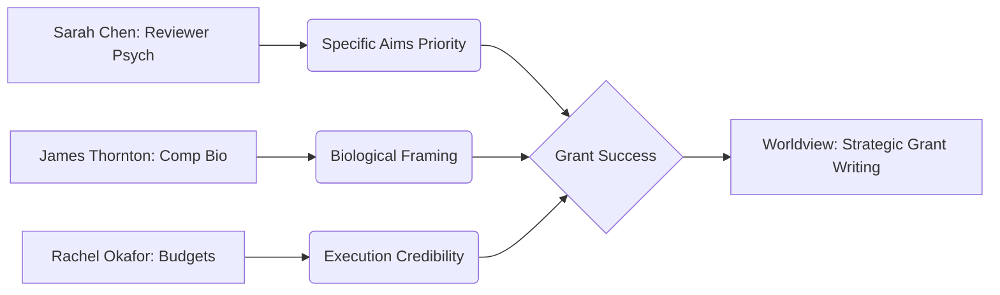

### State
The **Grant Writing Collective** worldview is currently in an **Onboarding State**. While the repository contains high-quality primary source memories from experienced researchers (Drs. Chen, Thornton, Okafor, and Williams), the core **Identity** of the organization (its specific mission and unified methodology) has not yet been explicitly defined in the compiled snapshot.

The knowledge graph is currently a collection of **Boulders** and **Stakes**—strong individual insights—but lacks the **Foundation** level claims that tie these into a cohesive organizational strategy.

**Key Knowledge Clusters:**
*   **Reviewer Psychology:** Insights into the "90-second gut reaction" and scoring heuristics.
*   **Strategic Sections:** Tactical guidance on Significance (Gap-Consequence-Unlock), Broader Impacts, and Budget Justification.
*   **Domain Specifics:** Specialized patterns for Computational Biology (Biological "Why" vs. Algorithmic "How").

---

### Stories
The repository contains five active story templates designed to transform the knowledge graph into actionable outputs.

| Story | Intent | Relationship to Whole | Approach |
| :--- | :--- | :--- | :--- |
| **North Star** | Synthesizes organizational priorities to guide AI coworkers. | The "Strategic Compass" for every session. | Queries the graph for active strategic bets (e.g., Specific Aims priority) to create a "Focus Lock." |
| **Summary** | Provides a high-level overview of the worldview, assets, and changes. | The "Executive Briefing" (this document). | Aggregates current state, story intents, and transaction history into a scannable brief. |
| **Changelog** | Narrates organizational shifts for external stakeholders. | The "Public Narrative" of evolution. | Translates technical SPARQL transactions into narrative entries about how the strategy is evolving. |
| **Graph Health** | Analyzes the structural integrity of the knowledge base. | The "Diagnostic Tool" for maintainers. | Uses topology metrics to identify "Orphan" concepts or "Sparse" domains (e.g., the current Identity gap). |
| **TX Summary** | Explains the impact of a single transaction. | The "Change Log" for individual PRs. | Generates a concise summary of knowledge added and its connection to existing memory. |

---

### Assets
The repository follows the standard `aswritten` architecture:

*   **`.aswritten/memories/`**: 5 primary source documents (transcripts/notes) covering reviewer psychology, budgets, and computational biology.
*   **`.aswritten/stories/`**: 5 `.md` templates for the stories listed above.
*   **`.aswritten/tx/`**: Contains `.sparql` transactions (e.g., `2024-09-15-significance-section-strategy.sparql`) that map memory facts into the graph.
*   **`.aswritten/snapshots/`**: Compiled RDF snapshots of the worldview.
*   **`ASWRITTEN.md` / `CLAUDE.md`**: Operational protocols governing AI interaction with collective memory.

---

### Transactions
*Sorted by newest first.*

| Transaction | Significance |
| :--- | :--- |
| **2025-06-12-computational-biology-specifics** | **Strategic Shift:** Moves from "novel algorithm" framing to biological problem-solving to overcome reviewer bias. |
| **2025-03-08-reviewer-psychology** | **Core Insight:** Establishes the "Specific Aims" page as the 90-second pivot point for funding success. |
| **2025-01-20-budget-justification-patterns** | **Execution Credibility:** Links fiscal planning directly to project execution capability in the eyes of reviewers. |
| **2024-11-02-broader-impacts-framing** | **Integration Strategy:** Challenges the "checkbox" approach; advocates for impacts that improve the science itself. |
| **2024-09-15-significance-section-strategy** | **Structural Framework:** Introduces the "Gap-Consequence-Unlock" model for significance sections. |

#### Knowledge Flow

**aswritten** — 0/0 claims grounded (Onboarding Mode). [5 memories ingested]. Ready to define the organizational Identity?