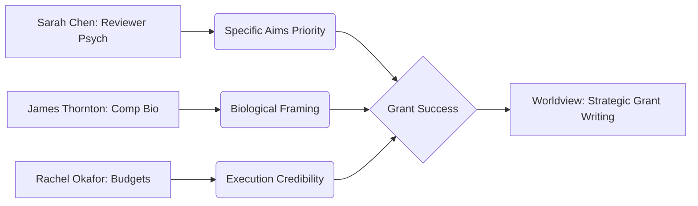

This summary reflects the current state of the **Grant Writing Collective** memory repository, a specialized knowledge base focused on the strategic and psychological aspects of securing research funding.

### State
The worldview is currently in an **Onboarding State**. While several high-quality primary source memories have been ingested, the "Identity" of the organization (mission, core description) and a unified strategic layer have not yet been explicitly defined in the compiled snapshot. 

The knowledge graph is currently a collection of "Boulders" and "Stakes"—strong individual insights from experienced researchers and reviewers—but it lacks the "Foundation" level claims that tie these insights into a cohesive organizational methodology.

**Key Knowledge Clusters:**
*   **Reviewer Psychology:** Deep insights into the "90-second gut reaction" and the scoring heuristics used by NSF panels.
*   **Strategic Sections:** Tactical guidance on Significance, Broader Impacts, and Budget Justification.
*   **Domain Specifics:** Specialized patterns for Computational Biology proposals.

---

### Stories
The repository contains four active story templates designed to transform the knowledge graph into actionable outputs.

| Story | Intent | Approach |
| :--- | :--- | :--- |
| **North Star** | Synthesizes organizational priorities to guide AI coworkers. | Will query the graph for active strategic bets and deadlines to create a "Focus Lock" for the session. |
| **Summary** | Provides a high-level overview of the worldview, assets, and changes. | (This document) Aggregates the current state and recent transactions into a scannable brief. |
| **Changelog** | Narrates organizational shifts for external stakeholders. | Translates technical SPARQL transactions into narrative entries about how the "Grant Writing" strategy is evolving. |
| **Graph Health** | Analyzes the structural integrity of the knowledge base. | Uses topology metrics to identify "Orphan" concepts or "Sparse" domains (e.g., the current gap in Identity). |

---

### Assets
The repository follows the standard `aswritten` architecture:

*   **`.aswritten/memories/`**: Contains 5 primary source documents (transcripts and notes from Dr. Sarah Chen, Dr. James Thornton, etc.).
*   **`.aswritten/stories/`**: Contains the `.md` templates for the stories listed above.
*   **`.aswritten/tx/`**: (Pending) This folder will house the `.sparql` transactions that map memory facts into the graph.
*   **`ASWRITTEN.md` / `CLAUDE.md`**: The operational protocols governing how AI agents interact with this specific memory.

---

### Transactions
*Note: Transactions are currently being processed by the extraction pipeline. Once the `.sparql` files are generated, they will appear here in reverse-chronological order.*

**Pending Ingestion:**
1.  **`2025-06-12-computational-biology-specifics.md`**: Focuses on framing algorithms as biological "whys."
2.  **`2025-03-08-reviewer-psychology.md`**: Establishes the "Specific Aims" page as the primary pivot point for funding.
3.  **`2025-01-20-budget-justification-patterns.md`**: Links fiscal planning to project execution credibility.
4.  **`2024-11-02-broader-impacts-framing.md`**: Challenges the "checkbox" approach to institutional outreach.
5.  **`2024-09-15-significance-section-strategy.md`**: Defines the "Gap-Consequence-Unlock" framework.

#### Knowledge Flow Projection

**aswritten** — 0/0 claims grounded (Onboarding Mode). [5 memories pending extraction]. Ready to define the organizational Identity?