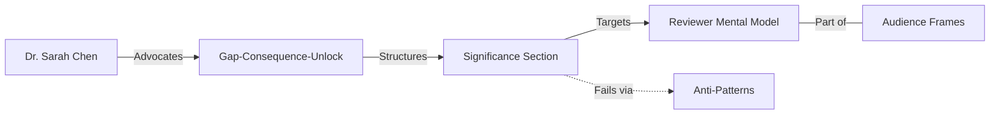

# Transaction: grant-writing-significance-section.md

**Source:** `.aswritten/memories/grant-writing-significance-section.md`
**Contributor:** n8n.aswritten.ai
**Date:** 2024-09-15
**Domain:** Grant Writing / Rhetorical Strategy

## Knowledge Added

- **New Actor:** **Dr. Sarah Chen**, a former NSF review panel member, providing practitioner-level insights.
- **Framework:** The **Gap-Consequence-Unlock** three-part structure for significance sections.
- **Key Concept:** **Reviewer Frame of Reference**—the idea that significance is about the reviewer's mental model, not the PI's research agenda.
- **Anti-Patterns:** Identified common failure modes including "statistics lists" and "relabeled background sections."
- **Stylistic Devices:** Use of **Antithesis** (e.g., "don't tell/show") and **Imperative Voice** to drive persuasive grant narratives.

## Connections

This transaction bridges the gap between general **Audience Framing** and specific **Problem Stakes** within the grant writing domain. It connects high-level rhetorical concepts like the **Rule of Three** and **Antithesis** to the practical constraints of NSF review panels.

## Worldview Impact

We can now move beyond treating "significance" as a measure of scientific merit and instead treat it as a **rhetorical intervention** in a reviewer's mental model. This shift allows us to diagnose proposal failures not as "weak science," but as "framing friction." This enables the creation of more targeted grant-writing guides and automated review tools that look for the specific **Gap-Consequence-Unlock** pattern rather than just topical relevance.