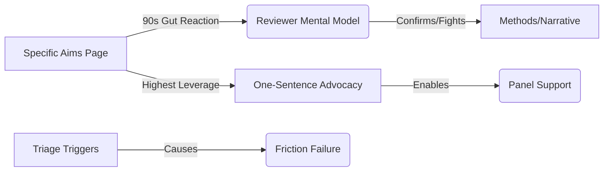

# Transaction: how-reviewers-actually-read-proposals.md

**Source:** `.aswritten/memories/how-reviewers-actually-read-proposals.md`
**Contributor:** n8n.aswritten.ai
**Date:** 2025-03-08
**Domain:** Grant Reviewer Psychology / NSF Panel Process

## Knowledge Added

- **Specific Aims Primacy:** Established that reviewers form a "fund/decline" gut reaction within the first 90 seconds (the Aims page).
- **Holistic Scoring Heuristic:** Reviewers do not average sections; they form an impression and then seek evidence to confirm it.
- **One-Sentence Advocacy:** A proposal's success depends on providing the reviewer with a single, explainable sentence to use during panel advocacy.
- **Triage Triggers:** Identified four specific anti-patterns:
    - Aims written as tasks rather than questions.
    - Significance framed as background.
    - Innovation claims based on the PI's own prior work.
    - Budgets disconnected from experimental reality.

## Connections

This transaction significantly deepens the **AudienceFrames** and **FrictionFailure** domains by connecting high-level strategy to the physical and temporal constraints of a reviewer (reading 35+ proposals). It updates the profile of **Dr. Sarah Chen**, linking her previous advice on "Significance" to this broader "Inside the Review Room" context.

## Worldview Impact

We can now answer exactly *why* certain structural errors lead to immediate rejection: they violate the reviewer's "confirmation bias" workflow. This shifts our understanding of grant writing from a "comprehensive documentation" task to a "psychological anchoring" task. This enables us to prioritize the Specific Aims page as the primary point of failure and provides a specific "one-sentence" test for all future content generation.