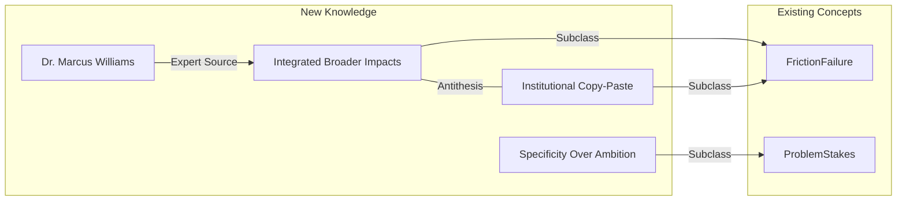

# Transaction: broader-impacts-framing

**Source:** `.aswritten/memories/broader-impacts-beyond-the-checkbox.md`
**Contributor:** n8n.aswritten.ai
**Date:** 2024-11-02
**Domain:** Grant Writing / NSF Broader Impacts

## Knowledge Added

- **New Actor:** `Dr. Marcus Williams`, retired NSF Program Officer (Division of Biological Infrastructure).
- **Key Concept: Integrated Broader Impacts:** The shift from "bolt-on" compliance to impacts structurally embedded in research design (e.g., field validation requiring tribal college partnerships).
- **Institutional Copy-Paste Risk:** Identification of a failure mode where PIs use generic university outreach boilerplate, which reviewers recognize and discount.
- **Specificity vs. Ambition:** The principle that named partners and existing relationships (evidenced by letters of support) outweigh ambitious but vague engagement plans.

## Connections

This transaction expands the **FrictionFailure** and **ProblemStakes** domains by providing specific practitioner counter-examples to successful grant framing. It links to the existing `narr:StyleMetrics` and `narr:Antithesis` patterns, specifically contrasting "tax/compliance" framing with "integrated/better science" framing.

## Worldview Impact

We can now distinguish between "performative" and "structural" broader impacts in grant narratives. This shift moves our understanding of "impact" from a post-research output to a core component of research methodology. This enables the generation of content that coaches PIs to avoid "institutional boilerplate" and instead leverage specific, existing partnerships as high-conviction evidence of feasibility.