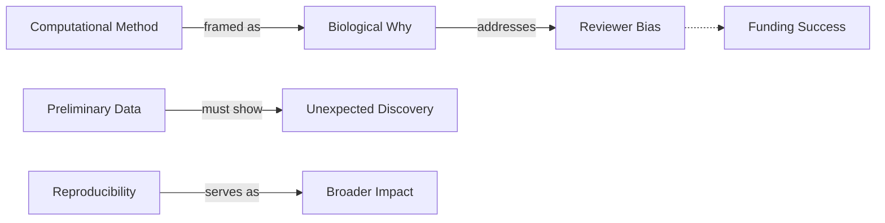

# Transaction: 2025-06-12-computational-biology-specifics

**Source:** `/2025-06-12-computational-biology-specifics.md`
**Contributor:** Dr. James Thornton
**Date:** 2025-06-12
**Domain:** Grant Writing / Computational Biology

## Knowledge Added

- **Concept: Biological Framing** – The strategy of describing computational methods as biological "whys" rather than algorithmic "hows" to overcome reviewer bias.
- **Concept: Computational Preliminary Data** – Redefined as demonstrating biological discovery in real data rather than benchmarking on simulated/toy data.
- **Concept: Reproducibility as Broader Impact** – Framing code and workflows as community resources rather than just "open source" checkboxes.
- **Relationship:** `ComputationalMethod` → `enables` → `BiologicalQuestion`.

## Connections

This transaction refines the general **Reviewer Psychology** (from `2025-03-08`) by applying it to the specific friction between wet-lab reviewers and computational PIs. It connects to the **Broader Impacts** domain (`2024-11-02`) by identifying "Reproducibility" as a domain-specific impact strategy for computational work.

## Worldview Impact

This addition shifts our understanding of grant writing from a general "persuasion" task to a "translation" task for technical domains. We can now provide specific guidance for computational researchers on how to navigate the "wet-lab bias" of review panels. It enables the creation of content that helps PIs transform technical milestones (algorithms/pipelines) into biological value propositions, moving the organizational focus toward domain-specific strategy rather than just general writing tips.