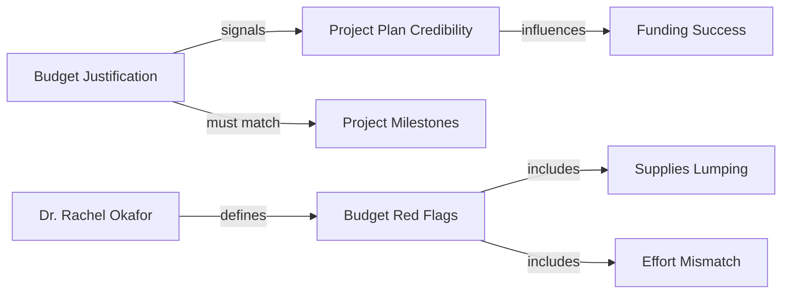

# Transaction: budget-justification-patterns

**Source:** `.aswritten/memories/budget-justification-hidden-scoring-criterion.md`
**Contributor:** n8n.aswritten.ai
**Date:** 2025-01-20
**Domain:** Grant Proposals / Budget Strategy

## Knowledge Added

- **New Actor:** **Dr. Rachel Okafor**, Grants Administrator at Johns Hopkins University, providing practitioner insights on budget red flags.
- **The "Hidden Criterion":** Introduced the concept that reviewers use the budget justification as a proxy for a PI's **execution competence**.
- **Budget-Timeline Alignment:** New requirement for **Effort/Milestone Alignment**—specifically that personnel costs (e.g., postdocs) must mathematically match the workstreams in the project timeline.
- **Capability Gap Justification:** Equipment requests must be justified by a specific **capability gap** (e.g., sample degradation limits) rather than generic need.
- **Red Flag - "Lumping":** Lumping supplies into single line items is now codified as a signal of poor experimental planning.

## Connections

This transaction strengthens the **Friction/Failure** and **KPIs/Success** domains by linking financial documentation to project management credibility.

## Worldview Impact

We can now evaluate grant narratives not just on scientific merit, but on **operational coherence**. This transaction shifts our understanding of the budget from a "compliance document" to a "strategic narrative" that can trigger proposal triage. It enables us to identify specific "red flag" patterns—such as 100% postdoc effort against parallel workstreams—that previously might have seemed like minor formatting issues but are actually seen by reviewers as fundamental planning failures.