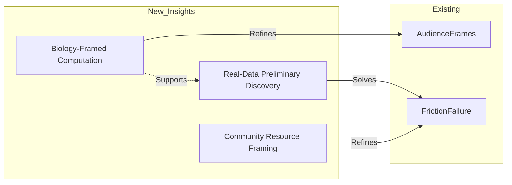

# Transaction: 2025-06-12-computational-biology-specifics.sparql

**Source:** `.aswritten/memories/computational-biology-proposals-domain-specific-patterns.md`  
**Contributor:** Dr. James Thornton (via n8n.aswritten.ai)  
**Date:** 2025-06-12  
**Domain:** Computational Biology Grant Strategy  

## Knowledge Added

- **Entity:** `narr:Actor_DrJamesThornton`, a 4x NSF/NIH funded computational biologist.
- **Framing Strategy:** Algorithmic novelty must be subordinated to biological utility. The "Algorithm is the *how*; Biology is the *why*."
- **Preliminary Data Standard:** Shift from "pipeline performance on toy data" to "biological discovery on real data." A single figure showing a unique discovery beats ten benchmarks.
- **Broader Impact Reframing:** Reproducibility (pipelines/workflows) should be positioned as a "community resource" rather than a "code deposit" to gain reviewer credit.

## Connections

This transaction specializes the general `narr:AudienceFrames` and `narr:FrictionFailure` patterns previously established by Dr. Sarah Chen. While Chen focused on the "Specific Aims" page as a gut-reaction trigger, Thornton provides the domain-specific content to win that reaction in computational fields. It bridges the gap between general grant writing and the specific structural biases of wet-lab reviewers.

## Worldview Impact

We can now provide specific guidance for computational PIs to overcome the "wet-lab bias" in review panels. This shifts our understanding of "preliminary data" from a technical validation step to a narrative one: its purpose is to prove the method's ability to find "biological truth" that others miss. This enables the creation of highly targeted coaching content for bioinformatics and systems biology faculty.